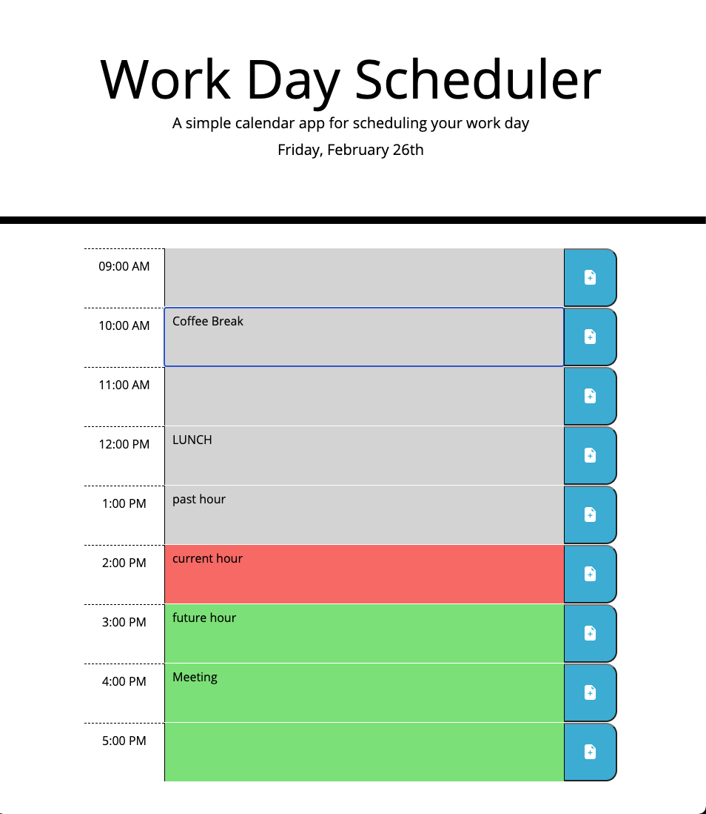
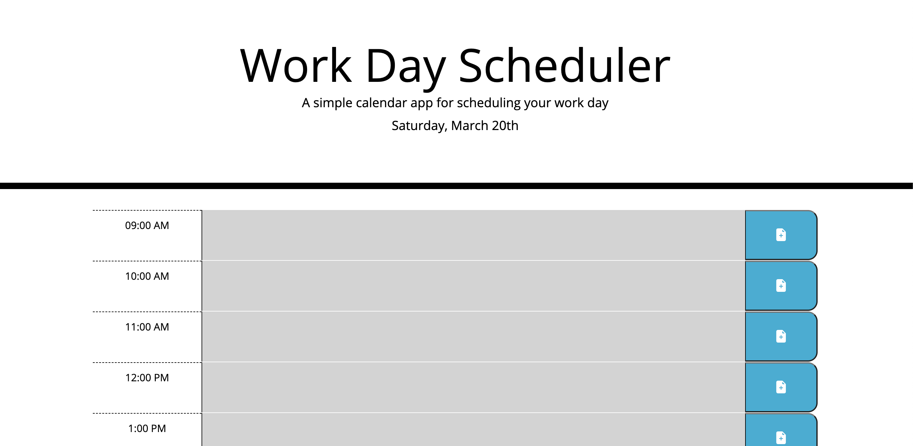

# workday-planner

## Description
A simple web app to help manage your work day effectively. 
Enter you schedule information into the appropriate time slot and click the 'save' button. You'll be able to come back to the page anytime through out the day and make changes or see what you have coming up. 

## Technology Used
HTML, CSS, JavaScript

## Links
### Github Repo
https://github.com/thebsking/workday-planner

### Deployed Application
https://thebsking.github.io/workday-planner/

## Screenshots

## License

## Contact
brandonscottking@gmail.com